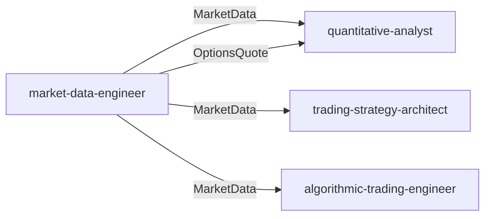
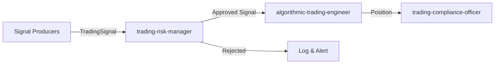
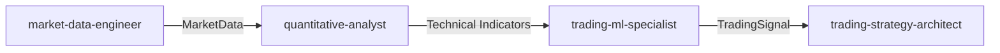
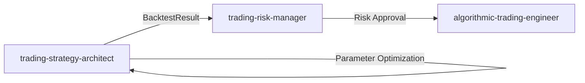
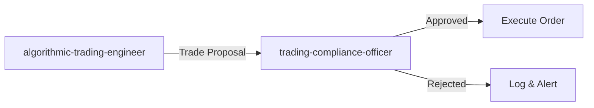
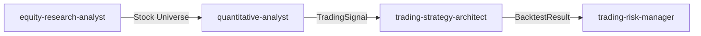
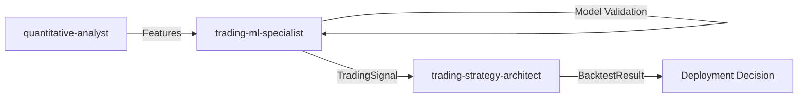

# Finance Domain - Ubiquitous Language Glossary

## Introduction

### Purpose
This glossary defines the canonical vocabulary shared across the 8 finance agents in the Claude Agents Pro trading system. It resolves terminology conflicts, establishes ownership boundaries, and ensures consistent communication between agents handling market data, quantitative analysis, strategy development, risk management, order execution, fundamental research, machine learning, and compliance.

**Context**: The finance domain exhibits natural terminology overlap due to shared concepts (volatility, signals, performance metrics, backtesting). This glossary disambiguates overloaded terms and defines which agent owns each capability.

### How to Use This Glossary

1. **When encountering ambiguous terms**: Check the Term Disambiguation section for context-specific meanings
2. **When designing agent interactions**: Reference the Domain Boundaries Table to identify the correct owner
3. **When implementing data flows**: Use Canonical Schemas to ensure consistent data structures
4. **When collaborating**: Follow Integration Patterns to understand standard workflows

### Contributing to the Glossary

**Adding New Terms**:
- Propose via pull request with: term definition, owning agent, consuming agents, example usage
- Get approval from domain modeling expert before merging

**Resolving Ambiguities**:
- If a term has multiple meanings, document all interpretations with agent context
- Prefer qualified terms (e.g., `historical_volatility` over generic `volatility`)

**Updating Schemas**:
- Schema changes require review by owning agent and all consuming agents
- Maintain backward compatibility or provide migration path

## Canonical Schemas

### MarketData
**Owner**: [`market-data-engineer`](./market-data-engineer.md)
**Consumers**: [`quantitative-analyst`](./quantitative-analyst.md), [`trading-strategy-architect`](./trading-strategy-architect.md), [`algorithmic-trading-engineer`](./algorithmic-trading-engineer.md)

```python
@dataclass
class MarketData:
    """Standard OHLCV market data structure"""
    symbol: str                    # Ticker symbol (e.g., "AAPL")
    timestamp: datetime            # Bar timestamp (timezone-aware UTC)
    open: Decimal                  # Opening price
    high: Decimal                  # High price
    low: Decimal                   # Low price
    close: Decimal                 # Closing price
    volume: int                    # Share volume
    vwap: Optional[Decimal]        # Volume-weighted average price
    trade_count: Optional[int]     # Number of trades in bar
    provider: str                  # Data source: "ALPACA", "ETRADE", "POLYGON", etc.
    timeframe: str                 # Bar interval: "1Min", "5Min", "1H", "1D"
```

**Notes**:
- All prices use `Decimal` for precision (not `float`)
- `timestamp` must be timezone-aware (UTC)
- `provider` tracks data lineage for quality monitoring
- `timeframe` normalizes across brokers (some use "1m", others "1Min")

---

### OptionsQuote
**Owner**: [`market-data-engineer`](./market-data-engineer.md)
**Consumers**: [`quantitative-analyst`](./quantitative-analyst.md)

```python
@dataclass
class OptionsQuote:
    """Options chain quote with Greeks"""
    symbol: str                    # Underlying ticker
    option_symbol: str             # OCC symbol (e.g., "AAPL240119C00150000")
    timestamp: datetime            # Quote timestamp (UTC)
    strike: Decimal                # Strike price
    expiration: datetime           # Expiration date
    option_type: str               # "call" or "put"
    bid: Decimal                   # Bid price
    ask: Decimal                   # Ask price
    last: Decimal                  # Last trade price
    volume: int                    # Contract volume
    open_interest: int             # Open interest
    implied_volatility: Optional[Decimal]  # Broker-provided IV (see Greeks ownership)
    greeks: Optional[Dict[str, Decimal]]   # From broker API: {delta, gamma, theta, vega, rho}
```

**Notes**:
- `greeks` from broker may differ from `quantitative-analyst` calculated Greeks (see Term Disambiguation)
- `option_symbol` follows OCC format: root + expiration + call/put + strike
- `implied_volatility` is broker-supplied; quant-analyst may recalculate

---

### TradingSignal
**Owner**: All signal producers ([`quantitative-analyst`](./quantitative-analyst.md), [`trading-ml-specialist`](./trading-ml-specialist.md), [`equity-research-analyst`](./equity-research-analyst.md))
**Consumers**: [`trading-risk-manager`](./trading-risk-manager.md), [`trading-strategy-architect`](./trading-strategy-architect.md), [`algorithmic-trading-engineer`](./algorithmic-trading-engineer.md)

```python
@dataclass
class TradingSignal:
    """Unified trading signal from any source"""
    signal_id: UUID                # Unique signal identifier
    symbol: str                    # Ticker symbol
    action: Enum["BUY", "SELL", "HOLD"]  # Signal action
    confidence: float              # Confidence score (0.0-1.0)
    timestamp: datetime            # Signal generation time (UTC)
    source: Enum["TECHNICAL", "FUNDAMENTAL", "ML"]  # Signal source type
    metadata: Dict[str, Any]       # Source-specific context

    # Examples of metadata by source:
    # TECHNICAL: {"rsi": 28, "macd_histogram": 0.5, "indicator": "RSI_MACD"}
    # FUNDAMENTAL: {"pe_ratio": 15.2, "roe": 0.18, "valuation": "undervalued"}
    # ML: {"model": "xgboost_v2", "prediction_proba": 0.72, "features_used": [...]}
```

**Notes**:
- All signal producers MUST use this schema for interoperability
- `confidence` allows risk manager to size positions appropriately
- `metadata` provides traceability for signal debugging

---

### Position
**Owner**: [`algorithmic-trading-engineer`](./algorithmic-trading-engineer.md)
**Consumers**: [`trading-risk-manager`](./trading-risk-manager.md), [`trading-compliance-officer`](./trading-compliance-officer.md)

```python
@dataclass
class Position:
    """Current position state"""
    symbol: str                    # Ticker symbol
    quantity: int                  # Shares held (negative = short)
    avg_entry_price: Decimal       # Average entry price
    current_price: Decimal         # Current market price
    unrealized_pnl: Decimal        # Unrealized profit/loss
    realized_pnl: Decimal          # Realized profit/loss (today)
    market_value: Decimal          # Current market value
    cost_basis: Decimal            # Total cost basis
    broker: str                    # Broker holding position
    account_id: str                # Account identifier
    last_updated: datetime         # Last update timestamp
```

**Notes**:
- `quantity` sign indicates long (positive) or short (negative)
- `cost_basis` adjusts for wash sales (compliance-officer responsibility)
- Position reconciliation: expected vs actual positions verified every minute

---

### BacktestResult
**Owner**: [`trading-strategy-architect`](./trading-strategy-architect.md)
**Consumers**: [`trading-risk-manager`](./trading-risk-manager.md), [`trading-ml-specialist`](./trading-ml-specialist.md)

```python
@dataclass
class BacktestResult:
    """Strategy backtest performance metrics"""
    strategy_name: str             # Strategy identifier
    start_date: datetime           # Backtest start
    end_date: datetime             # Backtest end
    initial_capital: Decimal       # Starting capital
    final_capital: Decimal         # Ending capital

    # Return Metrics
    total_return: Decimal          # Absolute return (%)
    cagr: Decimal                  # Compound annual growth rate

    # Risk-Adjusted Metrics
    sharpe_ratio: Decimal          # (Return - RFR) / Volatility
    sortino_ratio: Decimal         # Return / Downside deviation
    calmar_ratio: Decimal          # CAGR / Max drawdown

    # Drawdown Metrics
    max_drawdown: Decimal          # Maximum peak-to-trough decline (%)
    max_drawdown_duration: int     # Days in max drawdown

    # Trade Statistics
    total_trades: int              # Number of trades
    win_rate: Decimal              # Winning trades / total trades
    profit_factor: Decimal         # Gross profit / gross loss
    avg_trade: Decimal             # Average profit per trade

    # Transaction Costs
    total_commission: Decimal      # Total commissions paid
    total_slippage: Decimal        # Total slippage cost
```

**Notes**:
- NOT the same as `model_validation` (ML specialist's test set evaluation)
- Includes transaction costs (commission + slippage)
- Used to validate strategy before live deployment

---

### RiskMetrics
**Owner**: [`trading-risk-manager`](./trading-risk-manager.md)
**Consumers**: [`trading-strategy-architect`](./trading-strategy-architect.md), [`algorithmic-trading-engineer`](./algorithmic-trading-engineer.md)

```python
@dataclass
class RiskMetrics:
    """Portfolio-level risk metrics"""
    portfolio_value: Decimal       # Total portfolio value
    cash: Decimal                  # Available cash
    buying_power: Decimal          # Margin buying power

    # Risk Measures
    portfolio_beta: Decimal        # Portfolio beta vs market
    portfolio_volatility: Decimal  # Annualized portfolio volatility
    var_95: Decimal                # 95% Value at Risk (1-day)
    cvar_95: Decimal               # 95% Conditional VaR (expected loss beyond VaR)

    # Exposure Limits
    total_exposure: Decimal        # Sum of absolute position values
    net_exposure: Decimal          # Long exposure - short exposure
    leverage: Decimal              # Total exposure / portfolio value
    max_correlation: Decimal       # Highest correlation between any two positions

    # Drawdown Tracking
    current_drawdown: Decimal      # Current drawdown from peak (%)
    peak_value: Decimal            # All-time high portfolio value
    peak_date: datetime            # Date of peak
```

**Notes**:
- `portfolio_volatility` is distinct from individual asset volatility
- VaR/CVaR are portfolio-level; not per-position metrics
- Risk manager enforces limits, not trading-engineer

---

## Term Disambiguation

### Volatility (4 Meanings)

**Problem**: "Volatility" appears in multiple agent contexts with different calculation methods and purposes.

#### `historical_volatility`
- **Definition**: Annualized standard deviation of logarithmic returns
- **Used By**: [`market-data-engineer`](./market-data-engineer.md), [`quantitative-analyst`](./quantitative-analyst.md), [`trading-risk-manager`](./trading-risk-manager.md)
- **Calculation**: `σ = std(log(close[t] / close[t-1])) * sqrt(252)`
- **Context**: Historical price movement measurement
- **When to Use**: Position sizing, Bollinger Bands, ATR calculations

#### `implied_volatility`
- **Definition**: Market-implied volatility derived from option prices using Black-Scholes inversion
- **Used By**: [`quantitative-analyst`](./quantitative-analyst.md) for Greeks calculations
- **Source**: Options market prices (inverted from Black-Scholes)
- **Context**: Options pricing and volatility surface analysis
- **When to Use**: Options strategy selection, volatility arbitrage

#### `realized_volatility`
- **Definition**: Sum of squared intraday returns, annualized
- **Used By**: [`market-data-engineer`](./market-data-engineer.md)
- **Calculation**: `RV = sqrt(sum(r_i^2)) * sqrt(252)` where r_i are intraday returns
- **Context**: High-frequency volatility measurement
- **When to Use**: Comparing actual vs implied volatility, intraday risk management

#### `portfolio_volatility`
- **Definition**: Covariance-weighted portfolio risk (includes correlation effects)
- **Used By**: [`trading-risk-manager`](./trading-risk-manager.md)
- **Calculation**: `σ_p = sqrt(w' * Σ * w)` where Σ is covariance matrix
- **Context**: Portfolio-level risk assessment
- **When to Use**: Risk parity, portfolio optimization, VaR calculations

**Resolution**: Always use qualified term. If context-free "volatility" appears, default to `historical_volatility`.

---

### Signal (3 Meanings)

**Problem**: "Signal" is overloaded across technical, fundamental, and ML contexts.

#### `trading_signal` (Canonical)
- **Definition**: `TradingSignal` schema with action, confidence, timestamp, source
- **Used By**: ALL signal producers and consumers
- **Schema**: See Canonical Schemas section
- **When to Use**: ALWAYS use this for cross-agent communication

#### `indicator_signal`
- **Definition**: Technical indicator crossing threshold (e.g., RSI < 30)
- **Used By**: [`quantitative-analyst`](./quantitative-analyst.md) internally
- **Context**: Indicator-specific logic before creating `TradingSignal`
- **When to Use**: Internal to quant-analyst; converts to `trading_signal` for export

#### `ml_prediction`
- **Definition**: Model output probability or class prediction
- **Used By**: [`trading-ml-specialist`](./trading-ml-specialist.md) internally
- **Context**: Raw model output before signal generation
- **When to Use**: Internal to ML specialist; converts to `trading_signal` with confidence score

**Resolution**: External communication uses `TradingSignal` schema. Internal agent logic can use domain-specific terminology.

---

### Backtest vs Validation

**Problem**: Both terms describe testing, but serve different purposes.

#### `backtest`
- **Definition**: Trading simulation with transaction costs, slippage, and realistic execution
- **Owned By**: [`trading-strategy-architect`](./trading-strategy-architect.md)
- **Frameworks**: vectorbt, backtrader, zipline
- **Output**: `BacktestResult` with Sharpe, max drawdown, win rate
- **Includes**: Commission, slippage, market impact
- **When to Use**: Strategy validation before live deployment

#### `model_validation`
- **Definition**: ML train/test split evaluation with statistical metrics
- **Owned By**: [`trading-ml-specialist`](./trading-ml-specialist.md)
- **Frameworks**: scikit-learn walk-forward, time-series CV
- **Output**: Accuracy, precision, recall, F1, ROC-AUC
- **Does NOT Include**: Transaction costs (evaluated on predictions, not trades)
- **When to Use**: ML model selection, hyperparameter tuning

**Key Difference**:
- `model_validation` tests prediction accuracy (ML metrics)
- `backtest` tests trading profitability (financial metrics)
- ML models pass validation, then signals are backtested with transaction costs

**Workflow**: ML specialist validates model → generates signals → strategy architect backtests signals → risk manager validates risk metrics

---

### Greeks Ownership

**Problem**: Greeks appear in both broker APIs and calculated values.

#### `broker_greeks`
- **Definition**: Greeks returned from broker options chain API
- **Owner**: [`market-data-engineer`](./market-data-engineer.md)
- **Source**: Broker-calculated (Alpaca, E*TRADE APIs)
- **Schema**: `OptionsQuote.greeks` field
- **Accuracy**: Varies by broker, may use simplified models
- **When to Use**: Quick approximations, broker-provided data pipelines

#### `calculated_greeks`
- **Definition**: Greeks computed from Black-Scholes or binomial models
- **Owner**: [`quantitative-analyst`](./quantitative-analyst.md)
- **Source**: Black-Scholes formula with live pricing
- **Accuracy**: Higher precision, customizable risk-free rate and volatility inputs
- **When to Use**: Options strategy analysis, delta hedging, risk calculations

**Resolution**:
- Market-data-engineer stores `broker_greeks` in database
- Quantitative-analyst calculates `calculated_greeks` on-demand for strategy logic
- When precision matters, use `calculated_greeks`

---

### Performance Metrics Ownership

**Problem**: Both strategy-architect and risk-manager calculate performance metrics.

#### Strategy-Level Metrics (Owned by [`trading-strategy-architect`](./trading-strategy-architect.md))
- **Sharpe Ratio**: Risk-adjusted return for strategy evaluation
- **Sortino Ratio**: Downside risk-adjusted return
- **Calmar Ratio**: Return vs maximum drawdown
- **Win Rate**: Winning trades / total trades
- **Profit Factor**: Gross profit / gross loss
- **Average Trade**: Mean profit per trade
- **Context**: Backtest results, strategy comparison

#### Portfolio-Level Metrics (Owned by [`trading-risk-manager`](./trading-risk-manager.md))
- **VaR (Value at Risk)**: Maximum loss at confidence level
- **CVaR (Conditional VaR)**: Expected loss beyond VaR
- **Portfolio Beta**: Systematic risk vs market
- **Correlation Matrix**: Diversification analysis
- **Portfolio Volatility**: Covariance-weighted volatility
- **Leverage**: Total exposure / capital
- **Context**: Live portfolio monitoring, risk limit enforcement

**Key Difference**:
- Strategy metrics evaluate **individual strategy performance**
- Portfolio metrics assess **aggregate portfolio risk**
- Strategy-architect backtests strategies; risk-manager monitors live portfolio

---

## Domain Boundaries Table

| Capability | Primary Owner | Delegated To | Notes |
|------------|---------------|--------------|-------|
| **Market Data Ingestion** | [`market-data-engineer`](./market-data-engineer.md) | - | Multi-broker APIs (Alpaca, E*TRADE, Fidelity) |
| **Real-Time Data Streaming** | [`market-data-engineer`](./market-data-engineer.md) | - | WebSocket, SSE feeds |
| **Data Quality Monitoring** | [`market-data-engineer`](./market-data-engineer.md) | - | Gap detection, outlier alerts |
| **Options Chain Data** | [`market-data-engineer`](./market-data-engineer.md) | - | Stores broker-provided Greeks |
| **Technical Indicators** | [`quantitative-analyst`](./quantitative-analyst.md) | [`trading-ml-specialist`](./trading-ml-specialist.md) (as features) | RSI, MACD, Bollinger Bands, ATR |
| **Calculated Greeks** | [`quantitative-analyst`](./quantitative-analyst.md) | - | Black-Scholes, binomial models |
| **Statistical Analysis** | [`quantitative-analyst`](./quantitative-analyst.md) | - | Correlation, regression, time-series |
| **Backtesting Infrastructure** | [`trading-strategy-architect`](./trading-strategy-architect.md) | - | vectorbt, backtrader, zipline |
| **Strategy Performance Metrics** | [`trading-strategy-architect`](./trading-strategy-architect.md) | - | Sharpe, Sortino, Calmar, win rate |
| **Walk-Forward Analysis** | [`trading-strategy-architect`](./trading-strategy-architect.md) | [`trading-ml-specialist`](./trading-ml-specialist.md) (for ML validation) | Rolling train/test windows |
| **Position Sizing** | [`trading-risk-manager`](./trading-risk-manager.md) | - | Kelly, fixed fractional, volatility-based |
| **Portfolio Optimization** | [`trading-risk-manager`](./trading-risk-manager.md) | - | Mean-variance, risk parity, Black-Litterman |
| **VaR/CVaR Calculation** | [`trading-risk-manager`](./trading-risk-manager.md) | - | Portfolio-level risk metrics |
| **Risk Limit Enforcement** | [`trading-risk-manager`](./trading-risk-manager.md) | - | Position limits, leverage caps |
| **Order Execution** | [`algorithmic-trading-engineer`](./algorithmic-trading-engineer.md) | - | Multi-broker order routing |
| **Execution Algorithms** | [`algorithmic-trading-engineer`](./algorithmic-trading-engineer.md) | - | TWAP, VWAP, iceberg orders |
| **Position Reconciliation** | [`algorithmic-trading-engineer`](./algorithmic-trading-engineer.md) | - | Verify expected vs actual positions |
| **Trade Logging** | [`algorithmic-trading-engineer`](./algorithmic-trading-engineer.md) | [`trading-compliance-officer`](./trading-compliance-officer.md) (for audit) | Immutable audit trail |
| **Fundamental Analysis** | [`equity-research-analyst`](./equity-research-analyst.md) | - | DCF, financial ratios, screening |
| **Valuation Models** | [`equity-research-analyst`](./equity-research-analyst.md) | - | DCF, comparables, DDM |
| **Stock Screening** | [`equity-research-analyst`](./equity-research-analyst.md) | - | Fundamental criteria filters |
| **ML Feature Engineering** | [`trading-ml-specialist`](./trading-ml-specialist.md) | Consumes from [`quantitative-analyst`](./quantitative-analyst.md) | Lag features, rolling stats, indicators |
| **ML Model Training** | [`trading-ml-specialist`](./trading-ml-specialist.md) | - | XGBoost, LSTM, reinforcement learning |
| **Model Validation (ML)** | [`trading-ml-specialist`](./trading-ml-specialist.md) | - | Walk-forward, time-series CV |
| **Overfitting Detection** | [`trading-ml-specialist`](./trading-ml-specialist.md) | - | In-sample vs out-of-sample gaps |
| **PDT Rule Enforcement** | [`trading-compliance-officer`](./trading-compliance-officer.md) | - | Pattern Day Trader tracking |
| **Wash Sale Tracking** | [`trading-compliance-officer`](./trading-compliance-officer.md) | - | 30-day window, cost basis adjustment |
| **Tax Reporting** | [`trading-compliance-officer`](./trading-compliance-officer.md) | - | 1099-B generation |
| **Regulatory Compliance** | [`trading-compliance-officer`](./trading-compliance-officer.md) | - | FINRA, SEC, best execution |

---

## Integration Patterns

This section documents canonical workflows showing how agents collaborate on common tasks.

### Pattern 1: Market Data Flow
**Purpose**: Ingest, validate, and distribute market data to consumers



**Workflow**:
1. **market-data-engineer** ingests data from brokers (Alpaca, E*TRADE)
2. Validates data quality (gaps, outliers, staleness)
3. Stores in TimescaleDB with `provider` and `timeframe` metadata
4. Consumers query via standard `MarketData` schema
5. Quality issues flagged and logged for investigation

**Data Contract**: `MarketData` schema (see Canonical Schemas)

---

### Pattern 2: Signal Generation → Risk Validation → Execution
**Purpose**: Generate trading signals, validate risk, execute orders



**Signal Producers**: quantitative-analyst, trading-ml-specialist, equity-research-analyst

**Workflow**:
1. **Signal Producer** generates `TradingSignal` with action, confidence, metadata
2. **trading-risk-manager** validates:
   - Position sizing (Kelly, fixed fractional)
   - Portfolio limits (max exposure, correlation)
   - Risk metrics (VaR, leverage)
3. If approved: sends to **algorithmic-trading-engineer** for execution
4. If rejected: logs rejection reason, alerts strategy owner
5. **algorithmic-trading-engineer** executes order, updates `Position`
6. **trading-compliance-officer** validates PDT/wash sale rules post-trade

**Data Contracts**:
- Input: `TradingSignal`
- Output: `Position` (after execution)

---

### Pattern 3: Feature Engineering (Quant → ML)
**Purpose**: Share technical indicators as ML features



**Workflow**:
1. **market-data-engineer** provides clean `MarketData`
2. **quantitative-analyst** calculates indicators (RSI, MACD, Bollinger Bands, ATR)
3. **quantitative-analyst** exposes indicators as feature set (DataFrame or API)
4. **trading-ml-specialist** consumes features, adds lag/rolling stats
5. **trading-ml-specialist** trains model, generates `TradingSignal` with source="ML"
6. **trading-strategy-architect** backtests ML signals with transaction costs

**Key Principle**: Quant-analyst owns indicator logic; ML specialist enhances for model training

---

### Pattern 4: Strategy Backtest Workflow
**Purpose**: Backtest trading strategy with realistic execution



**Workflow**:
1. **trading-strategy-architect** designs strategy using signals (from quant/ML/research)
2. Runs backtest with vectorbt/backtrader including:
   - Commission (0.1% default)
   - Slippage (0.05% default)
   - Realistic order fills
3. Generates `BacktestResult` with Sharpe, max drawdown, win rate
4. **trading-risk-manager** validates:
   - Sharpe ratio >1.5 (out-of-sample)
   - Max drawdown <20%
   - Portfolio-level risk metrics
5. If approved: **algorithmic-trading-engineer** deploys strategy to live trading
6. If rejected: strategy-architect iterates on parameters

**Quality Gate**: Minimum Sharpe 1.5, max drawdown <20%, win rate >50%

---

### Pattern 5: Compliance Validation (Pre-Trade)
**Purpose**: Validate compliance rules before order execution



**Workflow**:
1. **algorithmic-trading-engineer** receives approved signal from risk-manager
2. Before execution, sends trade proposal to **trading-compliance-officer**
3. **trading-compliance-officer** validates:
   - PDT rules (day trades in rolling 5-day window)
   - Wash sale rules (30-day repurchase window)
   - Account restrictions (margin, buying power)
4. If approved: returns OK, engineer executes order
5. If rejected: returns reason code, logs for audit

**Performance Requirement**: <10ms compliance check (pre-trade critical path)

---

### Pattern 6: Fundamental + Technical Combination
**Purpose**: Combine fundamental screening with technical entry timing



**Workflow**:
1. **equity-research-analyst** screens stocks using fundamentals:
   - P/E ratio <15
   - ROE >15%
   - Debt/Equity <0.5
2. Creates filtered stock universe (e.g., 50 fundamentally strong stocks)
3. **quantitative-analyst** applies technical indicators to universe:
   - RSI <30 (oversold)
   - MACD > Signal (bullish)
4. Generates `TradingSignal` for stocks meeting both criteria
5. **trading-strategy-architect** backtests combined strategy
6. **trading-risk-manager** validates portfolio-level risk

**Key Principle**: Fundamental analysis for "what to trade", technical analysis for "when to trade"

---

### Pattern 7: ML Model Lifecycle
**Purpose**: Train, validate, and deploy ML trading models



**Workflow**:
1. **quantitative-analyst** provides feature set (indicators, statistical features)
2. **trading-ml-specialist** performs:
   - Walk-forward validation (NOT k-fold)
   - Overfitting detection (in-sample vs out-of-sample gap <10%)
   - Model evaluation with trading metrics (Sharpe, not just accuracy)
3. Generates `TradingSignal` with confidence scores
4. **trading-strategy-architect** backtests ML signals with transaction costs
5. Deployment if:
   - Out-of-sample Sharpe >1.5
   - Backtest Sharpe >1.5 (with costs)
   - Model-backtest gap <0.3 Sharpe points

**Anti-Pattern**: Using k-fold cross-validation (causes look-ahead bias in time-series)

---

## Anti-Patterns

Common mistakes to avoid when working across finance agents.

### ❌ Anti-Pattern 1: Using "Volatility" Without Qualifier
**Problem**: Ambiguous term causes calculation errors

**Bad**:
```python
# Which volatility?
position_size = calculate_position(volatility=0.25)
```

**Good**:
```python
# Explicit volatility type
position_size = calculate_position(historical_volatility=0.25)

# Or use context-specific term
portfolio_vol = calculate_portfolio_volatility(positions, covariance_matrix)
```

**Why**: Four different volatility types exist—always specify which one.

---

### ❌ Anti-Pattern 2: Multiple Agents Calculating Sharpe Ratio Inconsistently
**Problem**: Different agents use different Sharpe formulas, causing confusion

**Bad**:
```python
# trading-strategy-architect
sharpe = (returns.mean() - 0.02) / returns.std()  # 2% risk-free rate

# trading-ml-specialist
sharpe = returns.mean() / returns.std()  # Zero risk-free rate

# trading-risk-manager
sharpe = (returns.mean() - 0.03) / returns.std() * sqrt(252)  # Annualized
```

**Good**:
```python
# Shared utility in common library
from trading_metrics import calculate_sharpe_ratio

# All agents use consistent calculation
sharpe = calculate_sharpe_ratio(
    returns=returns,
    risk_free_rate=0.02,  # 2% annual
    annualize=True
)
```

**Why**: Inconsistent metrics prevent valid strategy comparison.

---

### ❌ Anti-Pattern 3: ML Specialist Reimplementing Backtest Infrastructure
**Problem**: Duplicate effort, inconsistent transaction cost modeling

**Bad**:
```python
# trading-ml-specialist implementing own backtest
class MLBacktester:
    def run_backtest(self, signals):
        # Custom backtest logic (different from strategy-architect)
        # May miss transaction costs or use different slippage model
        pass
```

**Good**:
```python
# ML specialist generates signals, delegates backtest to strategy-architect
ml_signals = ml_specialist.generate_signals(model)

backtest_result = trading_strategy_architect.backtest_signals(
    signals=ml_signals,
    commission=0.001,
    slippage=0.0005
)
```

**Why**: Strategy-architect owns backtest infrastructure with proven transaction cost models.

---

### ❌ Anti-Pattern 4: Data Engineer Calculating Greeks
**Problem**: Greeks calculation requires financial math expertise (not data engineering)

**Bad**:
```python
# market-data-engineer attempting to calculate Greeks
def calculate_delta(spot, strike, volatility, time_to_expiration):
    # Oversimplified or incorrect Black-Scholes implementation
    pass
```

**Good**:
```python
# market-data-engineer stores broker Greeks
options_quote = OptionsQuote(
    greeks=broker_response['greeks']  # From API
)

# quantitative-analyst calculates precise Greeks when needed
calculated_greeks = quantitative_analyst.calculate_greeks(
    spot=spot, strike=strike, volatility=iv, time=tte, rate=rfr
)
```

**Why**: Market-data-engineer owns data pipelines; quantitative-analyst owns financial math.

---

### ❌ Anti-Pattern 5: Ignoring Transaction Costs in ML Model Evaluation
**Problem**: ML model looks profitable without costs, unprofitable with costs

**Bad**:
```python
# ML specialist evaluates model without transaction costs
accuracy = (predictions == actuals).mean()  # 58% accuracy
# Assumes profitability without checking trade frequency or costs
```

**Good**:
```python
# ML specialist generates signals
ml_signals = model.predict(features)

# Strategy-architect backtests with costs
backtest_result = strategy_architect.backtest(
    signals=ml_signals,
    commission=0.001,  # 0.1%
    slippage=0.0005    # 0.05%
)

# Evaluate with trading metrics
if backtest_result.sharpe_ratio > 1.5:
    deploy_model()
```

**Why**: Prediction accuracy ≠ trading profitability. Always validate with transaction costs.

---

### ❌ Anti-Pattern 6: Using K-Fold Cross-Validation for Time-Series
**Problem**: Creates look-ahead bias by training on future data

**Bad**:
```python
# Shuffle and split (WRONG for time-series)
from sklearn.model_selection import KFold

kfold = KFold(n_splits=5, shuffle=True)  # ❌ shuffle=True is disastrous
for train_idx, test_idx in kfold.split(X):
    # Training on future data, testing on past (look-ahead bias)
    pass
```

**Good**:
```python
# Walk-forward analysis (time-series aware)
from sklearn.model_selection import TimeSeriesSplit

tscv = TimeSeriesSplit(n_splits=5)
for train_idx, test_idx in tscv.split(X):
    # Always train on past, test on future
    X_train, X_test = X[train_idx], X[test_idx]
    # Train model on X_train, evaluate on X_test
    pass
```

**Why**: Financial data has temporal structure—random shuffling destroys it and creates unrealistic results.

---

### ❌ Anti-Pattern 7: Skipping Position Reconciliation
**Problem**: Expected positions drift from actual positions, causing P&L errors

**Bad**:
```python
# Assume order fills match expectations
def execute_order(symbol, quantity):
    broker.place_order(symbol, quantity)
    # ❌ No verification that order filled as expected
    internal_position[symbol] += quantity
```

**Good**:
```python
# Reconcile positions every minute
def reconcile_positions():
    expected = get_internal_positions()
    actual = broker.get_positions()

    for symbol in set(expected.keys()) | set(actual.keys()):
        if expected.get(symbol, 0) != actual.get(symbol, 0):
            alert(f"Position mismatch {symbol}: expected {expected[symbol]}, actual {actual[symbol]}")
            # Resolve discrepancy
```

**Why**: Order fills are not guaranteed—always verify actual vs expected positions.

---

### ❌ Anti-Pattern 8: Hardcoding Risk-Free Rate
**Problem**: Stale risk-free rate causes incorrect Sharpe ratio calculations

**Bad**:
```python
RISK_FREE_RATE = 0.02  # Hardcoded 2%
sharpe = (returns - RISK_FREE_RATE) / volatility
```

**Good**:
```python
# Fetch current risk-free rate (e.g., 3-month T-bill)
def get_risk_free_rate() -> Decimal:
    # Update daily from Fed or market data provider
    return fetch_tbill_rate()

sharpe = (returns - get_risk_free_rate()) / volatility
```

**Why**: Risk-free rate changes over time (e.g., 0.1% in 2020, 5% in 2023)—fetch dynamically.

---

## Glossary Quick Reference

### Core Terms (Alphabetical)

| Term | Definition | Owner | See Section |
|------|------------|-------|-------------|
| **Backtest** | Trading simulation with transaction costs | [`trading-strategy-architect`](./trading-strategy-architect.md) | Backtest vs Validation |
| **Broker Greeks** | Greeks from broker API | [`market-data-engineer`](./market-data-engineer.md) | Greeks Ownership |
| **Calculated Greeks** | Black-Scholes computed Greeks | [`quantitative-analyst`](./quantitative-analyst.md) | Greeks Ownership |
| **Historical Volatility** | Annualized std dev of log returns | [`quantitative-analyst`](./quantitative-analyst.md) | Volatility (4 Meanings) |
| **Implied Volatility** | Market-implied vol from options | [`quantitative-analyst`](./quantitative-analyst.md) | Volatility (4 Meanings) |
| **Indicator Signal** | Technical indicator threshold cross | [`quantitative-analyst`](./quantitative-analyst.md) | Signal (3 Meanings) |
| **MarketData** | Standard OHLCV schema | [`market-data-engineer`](./market-data-engineer.md) | Canonical Schemas |
| **ML Prediction** | Raw model output | [`trading-ml-specialist`](./trading-ml-specialist.md) | Signal (3 Meanings) |
| **Model Validation** | ML train/test evaluation | [`trading-ml-specialist`](./trading-ml-specialist.md) | Backtest vs Validation |
| **OptionsQuote** | Options chain quote with Greeks | [`market-data-engineer`](./market-data-engineer.md) | Canonical Schemas |
| **Portfolio Volatility** | Covariance-weighted portfolio risk | [`trading-risk-manager`](./trading-risk-manager.md) | Volatility (4 Meanings) |
| **Position** | Current position state | [`algorithmic-trading-engineer`](./algorithmic-trading-engineer.md) | Canonical Schemas |
| **Realized Volatility** | Sum of squared intraday returns | [`market-data-engineer`](./market-data-engineer.md) | Volatility (4 Meanings) |
| **TradingSignal** | Unified signal schema | All producers/consumers | Canonical Schemas |

---

## Version History

| Version | Date | Author | Changes |
|---------|------|--------|---------|
| 1.0 | 2025-10-02 | domain-modeling-expert | Initial glossary creation with 8 agent coverage |

---

## Appendix: Agent Cross-Reference

| Agent | File | Primary Domain |
|-------|------|----------------|
| Market Data Engineer | [market-data-engineer.md](./market-data-engineer.md) | Data ingestion, quality, storage |
| Quantitative Analyst | [quantitative-analyst.md](./quantitative-analyst.md) | Technical indicators, Greeks, statistics |
| Trading Strategy Architect | [trading-strategy-architect.md](./trading-strategy-architect.md) | Backtesting, strategy validation, performance |
| Trading Risk Manager | [trading-risk-manager.md](./trading-risk-manager.md) | Position sizing, portfolio optimization, VaR |
| Algorithmic Trading Engineer | [algorithmic-trading-engineer.md](./algorithmic-trading-engineer.md) | Order execution, broker integration, reconciliation |
| Equity Research Analyst | [equity-research-analyst.md](./equity-research-analyst.md) | Fundamental analysis, valuation, screening |
| Trading ML Specialist | [trading-ml-specialist.md](./trading-ml-specialist.md) | ML models, walk-forward validation, feature engineering |
| Trading Compliance Officer | [trading-compliance-officer.md](./trading-compliance-officer.md) | PDT rules, wash sales, tax reporting, compliance |

---

**Questions or Ambiguities?**
Contact: domain-modeling-expert or create issue in Claude Agents Pro repository.

---
*Licensed under Apache-2.0*
